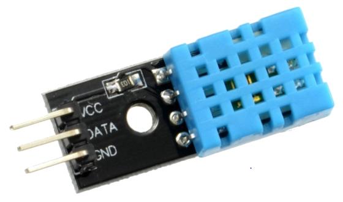
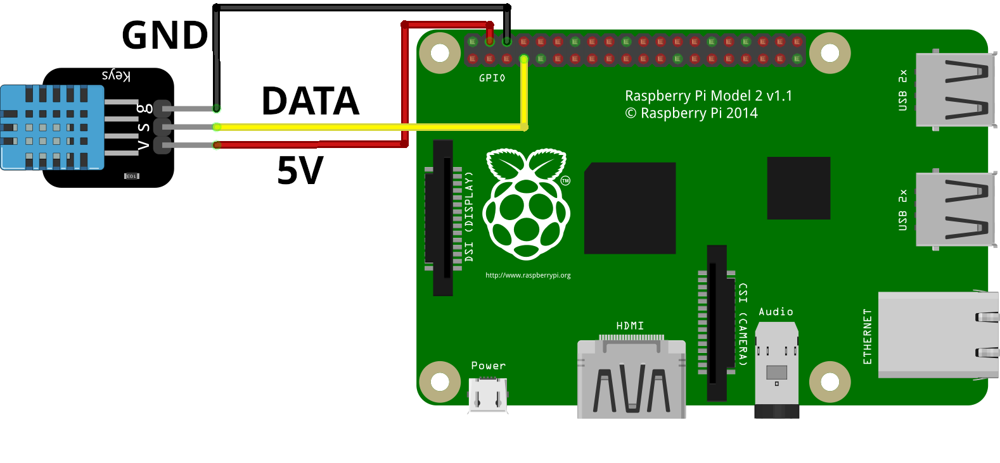

# DHT11

Sensor de temperatura y humedad



## Instalación

```sh
$ pip install Adafruit_DHT
```

## Conexiones



|**DHT11**  | **RPI(pin/gpio)**|
|---|---|
|VCC|4(3-5V)|
|GND |6(GND)|
|data|7(GPIO 4)|

## `codigo.py`

```py
import Adafruit_DHT
class DHT11:
    def __init__(self, pin):
        self.sensor_type = Adafruit_DHT.DHT11
        self.pin = pin
        self.humedad=None
        self.temperatura=None
    def obtener_data(self):
        try:
            self.humedad, self.temperatura = Adafruit_DHT.read(self.sensor_type, self.pin)
            return self.humedad, self.temperatura
        except RuntimeError as error:
            print(error.args[0])
            return None, None
    def mostrar_data(self):
        self.obtener_data()
        print(self.humedad, self.temperatura)
dht11=DHT11(4)
dht11.mostrar_data()
```
