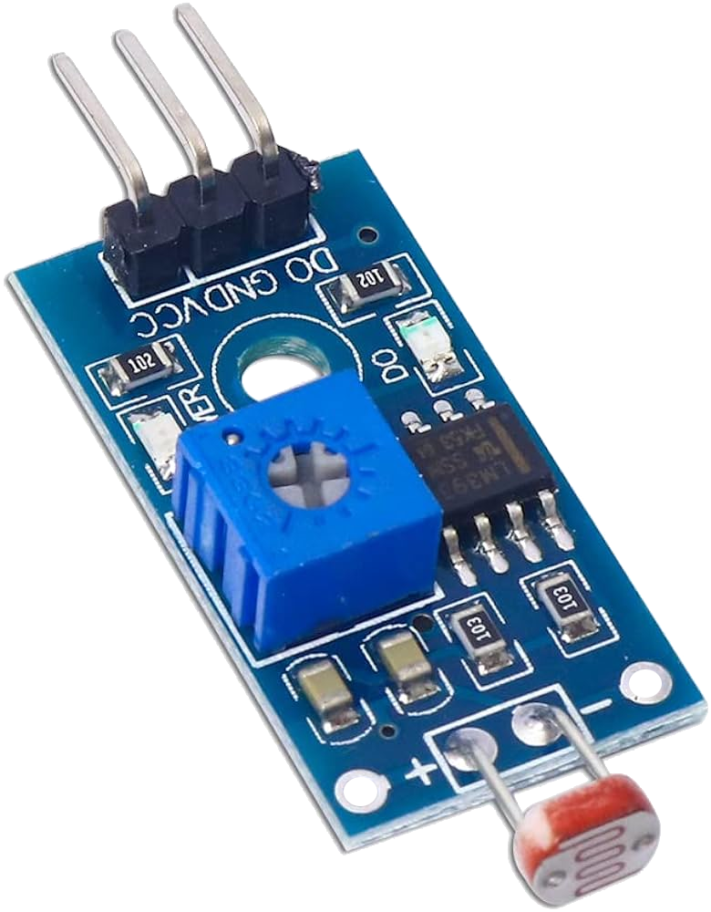
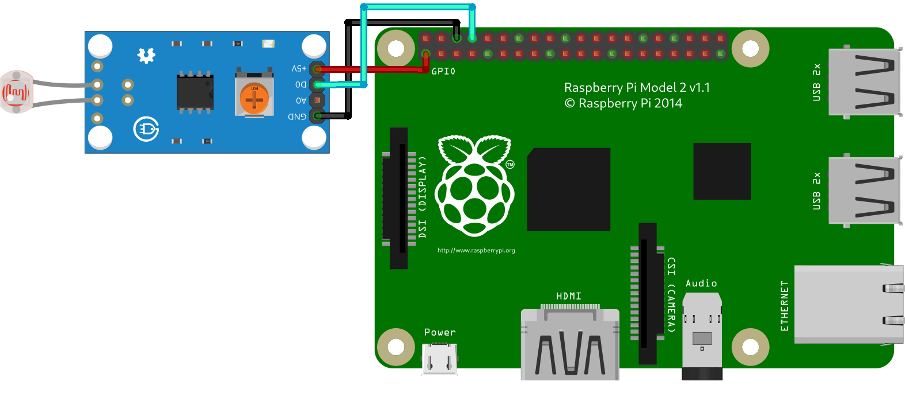

# LM393-LDR

Módulo LDR fotoresistencia sensor luz LM393



## Conexiones



|**LM393-LDR**  | **RPI(pin/gpio)**|
|---|---|
|D0|8(GPIO 14)|
|GND |GND|
|VCC(3-5v)|3.3V|

## `codigo.py`

```py
import RPi.GPIO as GPIO
class LM393_LDR:
    def __init__(self,pin): #pin gpio
        GPIO.setmode(GPIO.BCM) #gpio
        GPIO.setwarnings(False)
        self.pin=pin
        GPIO.setup(self.pin,GPIO.IN)
        self.valor=None
    def obtener_valor(self):
        self.valor = GPIO.input(self.pin)
        return self.valor
    def ver_valor(self):
        self.obtener_valor()
        print(self.valor)
        self.limpiar()
    def limpiar(self):
        GPIO.cleanup()
ldr=LM393_LDR(14)
ldr.ver_valor()
```
