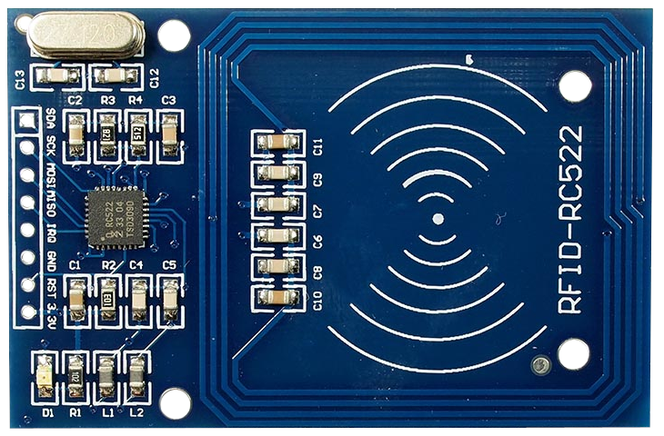
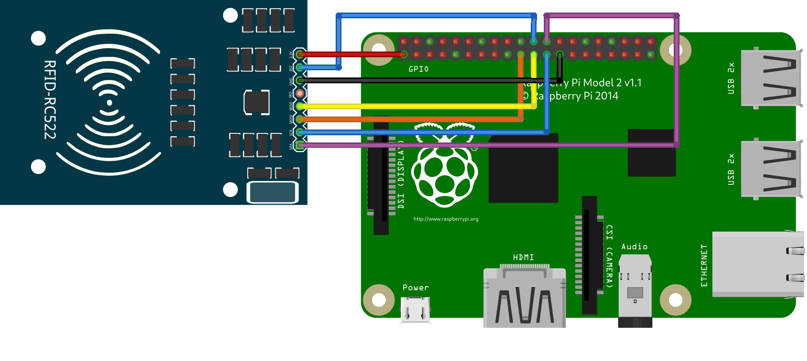

# MFRC522



## Instalación

1. Habilitamos SPI de nuestra Raspberry Pi

    ```sh
    $ sudo raspi-config
        3. Interfacing Options/I4 SPI/Would you like the SPI interface to be enabled? <Yes> 
    ```

2. Instalacion de librerias

    ```sh
    $ sudo vim /boot/config.txt #no estoy seguro que sea necesario
        dtparam=spi=on
    $ lsmod | grep spi
    $ pip install spidev
    $ pip install mfrc522
    ```

## Conexiones



|**MFRC522**  | **Rpi(pin/gpio)**|
|---|---|
|SDA |24(GPIO 8)|
|SCK|23(GPIO 11)|
|MOSI|19(GPIO 10)|
|MISO|21(GPIO 9)|
|GND |25(GND)|
|RST |22(GPIO 25)|
|3.3V|1(3.3V)|

## `codigo.py`

```py
import RPi.GPIO as GPIO
from mfrc522 import SimpleMFRC522
class RFID:
    def __init__(self):
        self.reader = SimpleMFRC522()
    def escribir(self):
        text = input('Nueva data:')
        print("Coloca tu tarjeta para escribir: ")
        self.reader.write(text)
        print("Escrito")
    def leer(self):
        id, text = self.reader.read()
        print(id)
        print(text)
    def borrar(self):
        print("Coloca tu tarjeta para borrar: ")
        self.reader.write("")  # Escribir un string vacío borra los datos
        print("Data borrada")
    def limpiar(self):
        GPIO.cleanup()
        print("Recursos GPIO liberados")
    def ejemplo(self):
        while True:
            option = input("Elige una opción (1: Escribir, 2: Leer, 3: Borrar, 4: Salir): ")
            if option   == '1': self.escribir()
            elif option == '2': self.leer()
            elif option == '3': self.borrar()
            elif option == '4': 
                self.limpiar()
                break
            else: print("Invalid option. Please choose again.")
rfid = RFID()
rfid.ejemplo()
```
