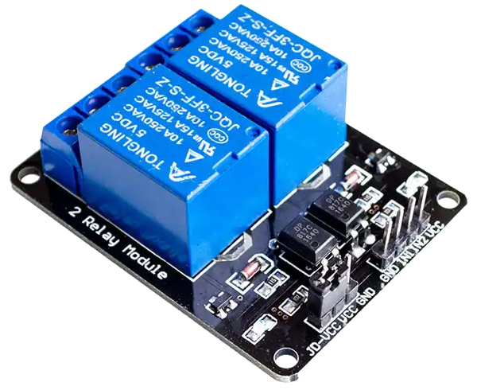
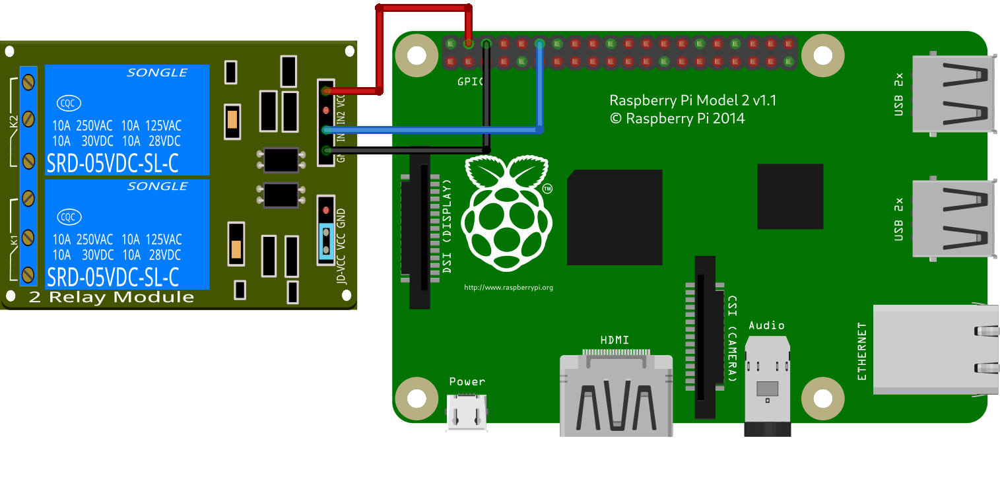

# RELE



## Conexiones



|**RELE**  | **RPI(pin/gpio)**|
|---|---|
|IN1|12(GPIO 18)|
|VCC|4(5V)|
|GND |5(GND)|

## `codigo.py`

```py
import RPi.GPIO as GPIO
import time
class Rele:
    def __init__(self, pin):
        GPIO.setmode(GPIO.BCM)
        GPIO.setwarnings(False)
        GPIO.setup(pin, GPIO.OUT)
        self.pin = pin
    def abrir(self):
        print("abierto")
        GPIO.output(self.pin, GPIO.HIGH)
    def cerrar(self):
        print("cerrado")
        GPIO.output(self.pin, GPIO.LOW)
    def limpiar(self):
        GPIO.cleanup()
    def ejemplo(self):
        self.abrir()
        time.sleep(3)
        self.cerrar()
rele=Rele(18) #gpio18
rele.ejemplo()
```
