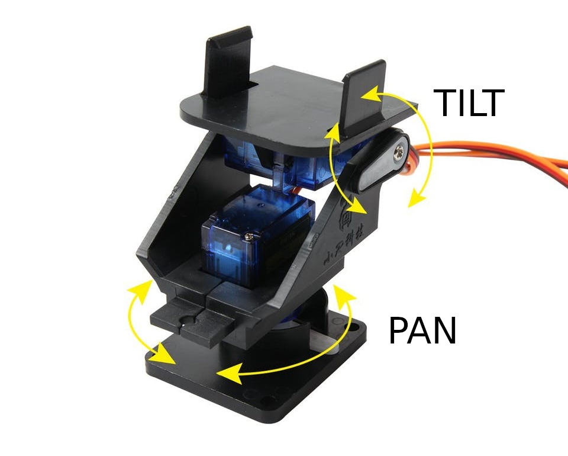
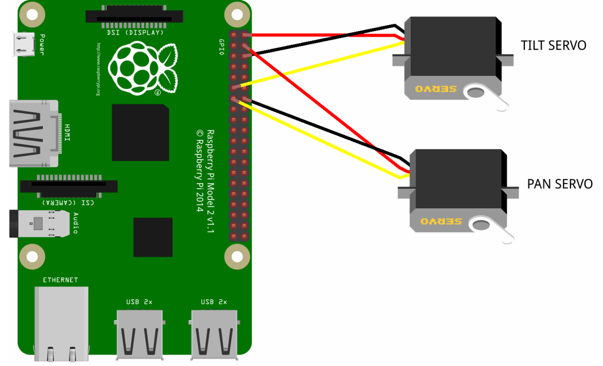

# Pan Tilt



## Controlarlo con las flechas del teclado
1. Conexion

	

2. `codigo.py`

	```py
	#!/usr/bin/env python
	from time import sleep
	import RPi.GPIO as GPIO
	GPIO.setmode(GPIO.BCM)
	GPIO.setwarnings(False)
	pan,tilt = 27,17
	GPIO.setup(tilt, GPIO.OUT) # white => TILT
	GPIO.setup(pan, GPIO.OUT) # gray ==> PAN
	p,t=90,45
	p2,t2=p,t
	#Teclado
	import curses
	screen = curses.initscr() #inicializa
	curses.noecho() #no muestra input
	curses.cbreak() #ejecuta sin presionar enter
	screen.keypad(1); #Habilita teclas especiales ejm: flechas
	def setServoAngle(servo, angle):
	    assert angle >=10 and angle <= 170
	    pwm = GPIO.PWM(servo, 50)
	    pwm.start(8)
	    dutyCycle = angle / 18. + 3.
	    pwm.ChangeDutyCycle(dutyCycle)
	    sleep(0.3)
	    pwm.stop()
	if __name__ == '__main__':
	    while True:
		Char = screen.getch()
		movimiento=30
		if Char == curses.KEY_UP:
		    t2=t-movimiento
		    setServoAngle(tilt, t2)
		    print ("telescope up: ",t2)
		if Char==curses.KEY_DOWN:
		    t2=t+movimiento
		    setServoAngle(tilt, t2)
		    print ("telescope Down: ",t2)
		if Char==curses.KEY_LEFT:
		    p2=p+movimiento
		    setServoAngle(pan, p2)
		    print ("telescope Down: ",p2)
		if Char==curses.KEY_RIGHT:
		    p2=p-movimiento
		    setServoAngle(pan, p2)
		    print ("telescope Down: ",p2)
		if Char==ord('x'):
		    print("Program Ended")
		    break
		t=t2
		p=p2
	GPIO.cleanup()
	curses.endwin() #Restore terminal to its original operating mode
	```

3. Ejecutar

	```
	$ python3 codigo.py
	```

	
