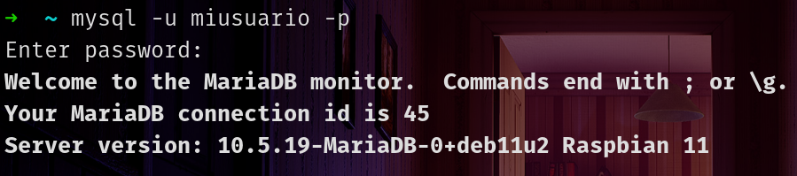

# GUARDAR DATA DE SENSOR DHT11 EN UNA BASE DE DATOS
## BASE DE DATOS EN LA RASPBERRY PI
1. Instalamos mariadb
    ```sh
    $ sudo apt install mariadb-server
    ```
2. Creamos usuario en mariadb
    * Ingresamos como super usuario
        ```sh
        $ sudo su
        ```
    * Iniciar mysql como usuario root
        ```sh
        # mysql -u root
        ```
    * Vemos los usuarios existentes
        ```sql
        SELECT user, host FROM mysql.user;
        ```
    * Creamos nuevo usuario
        ```sql
        CREATE USER 'miusuario'@'localhost' IDENTIFIED BY '1234';
        ```
    * Conceder permisos a usuario
        ```sql
        GRANT ALL PRIVILEGES ON *.* TO 'miusuario'@'localhost' WITH GRANT OPTION;
        ```
    * Confirmar que el usuario se ha creado
        ```sql
        SELECT user, host, authentication_string, plugin FROM mysql.user WHERE user = 'miusuario';
        ```
    * Cerrar sesión en mysql
        ```sql
        exit
        ```
    * Salir de superusuario de linux
        ```sh
        exit
        ```
    * Iniciar sesión de mariaDB con el usuario creado.
        ```sh
        $ mysql -u miusuario -p
        ```
3. Crear base de datos
    * Creamos base de datos.
        ```sql
        create database midb;
        ```
    * Usamos la base de datos creada.
        ```sql
        use midb;
        ```
4. Crear tabla
    * Creamos una tabla llamada dht11
        ```sql
        CREATE TABLE dht11(id INT AUTO_INCREMENT PRIMARY KEY,fecha DATE,hora TIME,temperatura FLOAT,humedad FLOAT);
        ```
## HARDWARE
|**Conexión del sensor DHT11 con la Raspberry Pi**|
|:--:|
||

|**Raspberry Pi**|**DHT11**|
|--------------|-----|
|pin4 (5v) | vcc(3-5v) |
|pin6 (GND) | GND |
|pin7 (gpio4) |data |

|**Mi implementación de hardware**|
|:--:|
||

## PROGRAMACIÓN
1. Instalación
    * Instalamos la librería para el sensor DHT11
        ```sh
        $ pip3 install Adafruit_DHT
        ```
    * Instalamos la librería para tener acceso a la base de datos que he creado con mariaDB
        ```sh
        pip3 install pymysql
        ```
2. Código python: `codigo.py`
    ```py
    import Adafruit_DHT
    import time
    import datetime as hourSystem
    import pymysql
    SENSOR_DHT = Adafruit_DHT.DHT11
    PIN_DHT = 4
    # Conecta con la base de datos
    connection = pymysql.connect(host="localhost", user="miusuario", password="1234", database="midb")
    cursor = connection.cursor()
    while True:
        try:
            humedad, temperatura = Adafruit_DHT.read(SENSOR_DHT, PIN_DHT)
            fecha = hourSystem.datetime.today().strftime('%Y-%m-%d')
            hora  = hourSystem.datetime.today().strftime('%H:%M:%S')
            if humedad is not None and temperatura is not None:
                # Inserta la informacion en la tabla
                cursor.execute("INSERT INTO dht11(id, fecha, hora, temperatura, humedad) VALUES (NULL, %s, %s, %s, %s)", (fecha, hora, temperatura, humedad))
                connection.commit()
                print(f"fecha={fecha} hora={hora} Temperatura={temperatura:.1f}°C Humedad={humedad:.1f}%")
            else:
                print("Falla en la lectura. Revisa el circuito")
        except RuntimeError as error:
            print(error.args[0])
        time.sleep(3)
    ```
3. Ejecución: Ejecutamos el código python para que se siga ejecutando aún así se cierre la terminal
    ```sh
    $ nohup python codigo.py &
    ```
4. Verificamos que la data se guarda en nuestra base de datos. Hacemos una consulta a nuestra tabla llamada dht11
    ```sql
    select * from dht11;
    ```

    |**Data del sensor DHT11 almacenada en la base de datos**|
    |:--:|
    ||

## CONEXIÓN REMOTA A LA RASPBERRY PI POR SSH

|**Conexión remota**|
|:--:|
||

En este caso la IP de la Raspberry Pi es 192.168.1.9. Se está haciendo una conexión remota a una Raspberry Pi desde una computadora con el sistema operativo Debian usando ssh. Al ejecutar el comando para la conexión ssh se va a pedir la contraseña del usuario de la Raspberry Pi llamado "pi".

```sh
$ ssh pi@192.168.1.9
```

|**Conexión remota por ssh establecida**|
|:--:|
||

```sql
mysql -u miusuario -p
```

|**Ya podemos iniciar sesión en mariaDB para acceder a la base de datos**|
|:--:|
||
