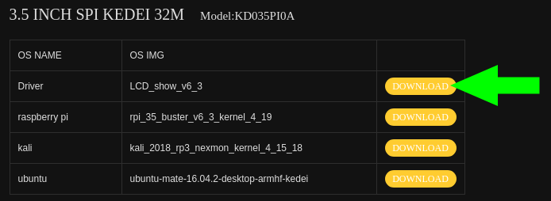

# [Display Kedei TFT LCD 3.5 inch](http://kedei.net/)


1. Descargar el [driver kedei](http://kedei.net/download.html)

	

	```sh
	$ tar xf LCD*.tar.gz
	$ cd LCD_show_v6_1_3
	$ ./LCD35_v
	```

2. Modos de uso

	* Para usar la pantalla kedei (No se podrá usar RCA ni HDMI)

		```sh
		$ ./LDC35_V
		```

		

	* Para volver a la normalidad (No se podrá usar la pantalla kedei)

		```sh
		$ ./LCD_hdmi
		```
